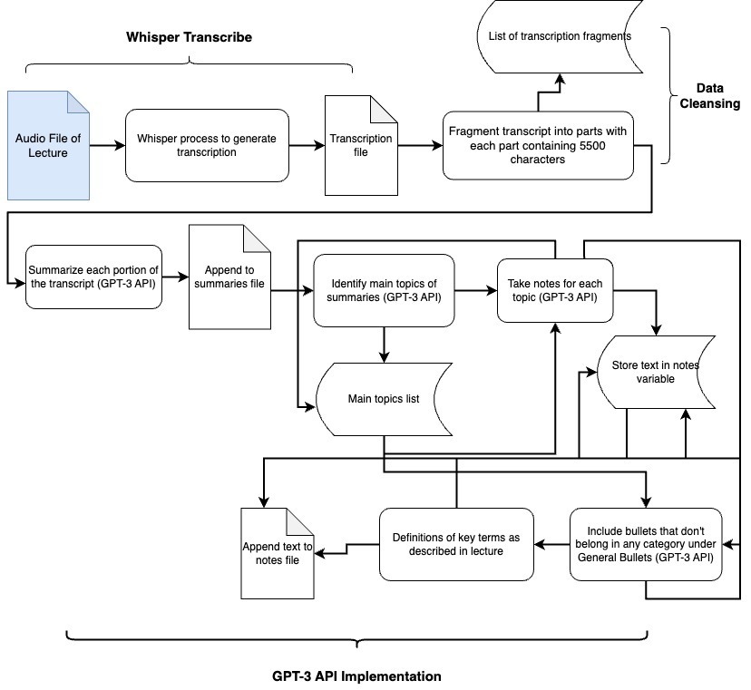

# NoteNinjaAI

Psst! Are you tired of listening to hour-long lectures and taking notes till your wrist hurts? Or do you want the jist of a lesson you missed? Enter **NoteNinjaAI** - powered by OpenAI services, this program can transform a lecture audio or transcription into structured notes, containing main topics followed by sub-bullets; general bullet points; and key definitions. You can preview the application by clicking here: [https://ravitejguntuku-noteninjaai.hf.space](https://ravitejguntuku-noteninjaai.hf.space)

## HuggingFace Configuration

---

title: NoteNinjaAI
emoji: 👀
colorFrom: blue
colorTo: yellow
sdk: gradio
sdk_version: 3.35.2
app_file: app.py
pinned: false
license: apache-2.0

---

Check out the configuration reference at https://huggingface.co/docs/hub/spaces-config-reference

## Application Architecture



As the architecture diagram above illustrates, the underlying functionality of the NoteNinjaAI application is not nearly as simple as providing a link to a lecture's MP3 file and asking ChatGPT to take notes (at the time of writing, ChatGPT is NOT capable of processing audio directly). First, since the GPT-3 LLM works with text, the program first needs to transcribe the lecture audio file, and a potent library for accomplishing this task is OpenAI's Whisper (this implementation uses the Whisper "base" model with its default settings).

One of the main obstacles with using OpenAI's GPT-3 API is that each request has a 4096 token limit, which roughly translates into ~5000 characters. So, in order to allow GPT-3 to note-take on a transcription with a copious amount of words, the transcription should be chunked into segments with ~5000 characters, and each segment should be summarized in a certain amount of words determined by the number of segments — these short summaries are written to a summary compendium file. Then, GPT-3 is asked to identify seven main topics (I had to cap it at 7 to avoid excessive redundancy, especially for short lectures) and jot down six sub-bullets underneath each main topic as well as eight general bullet points (bullet points that don't conform to any particular category) based on the compendium of summaries. GPT-3 is finally prompted to define key terms in the lecture based on the summaries. To ensure concision (GPT-3 loves circumlocution), each bullet point is limited to ten words.

## Steps for Installation

Given that the majority of this app's functionality is powered by OpenAI services, be sure to install the python libraries for openai and openai-whisper (be sure that [Python](https://www.python.org/) is installed and properly configured beforehand):

```bash
pip install openai
pip install openai-whisper
```

The front-end of this application is powered by the [Gradio](https://www.gradio.app/) python library, which can be installed as shown below:

```bash
pip install gradio
```

Clone the repository and move to its folder on your local machine:

```bash
git clone https://github.com/RaviTejGuntuku/NoteNinjaAI.git
cd NoteNinjaAI
```

Create your own OpenAI API Secret Key — follow [this article](https://gptforwork.com/help/gpt-for-sheets/setup/create-openai-key) to learn how if necessary. Copy the secret key into a safe location. Create a .env file in the project's directory containing one line:

```
OPENAI_SECRET_KEY="<API_KEY>"
```

Replace <API_KEY> with your OpenAI API Secret Key.

Finally, fire up the Gradio application by running the app.py file:

```bash
python app.py
```

## Research Study - Evaluating Whether GPT-3 Can Replace Human Note-Taking

The NoteNinjaAI application was build for the purpose of conducting a research study which, in essence, determines whether GPT-3 or a high-school student takes better notes on a World History AP lecture about "Unresolved Tensions After World War I." The notes were evaluated for their degree of similarity to the teacher's notes copy (the teacher master copy) in terms of concision, structure, and verbiage. If you wish to, click below to peruse through the entire study:

[https://ravitej.s3.amazonaws.com/Guntuku_GPT3_Notetaking.pdf](https://ravitej.s3.amazonaws.com/Guntuku_GPT3_Notetaking.pdf)

## Areas for Improvement

- [ ] Update algorithm to use the GPT-4 API
- [ ] Create a better system to segment transcriptions ... I would want GPT-3's notes to be synthesized directly from the text of the primary source (the lecture audio)
- [ ] Incorporate a fact-checking mechanism (GPT is quite guilty of stating blatant lies with a glossy semblance)
